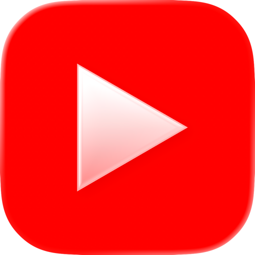
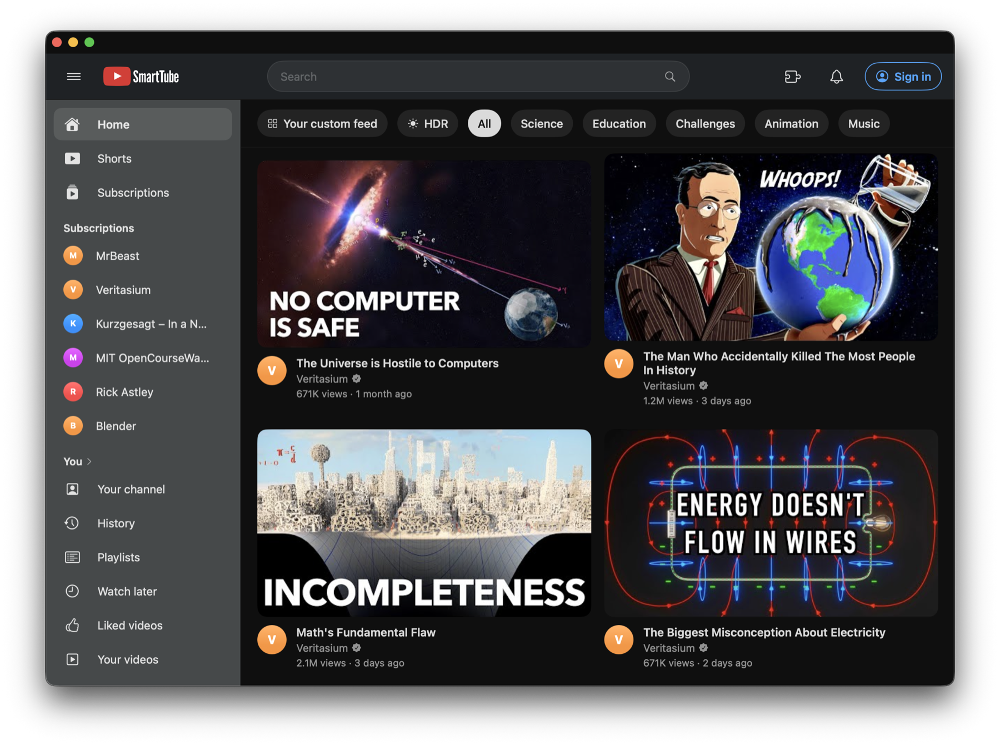
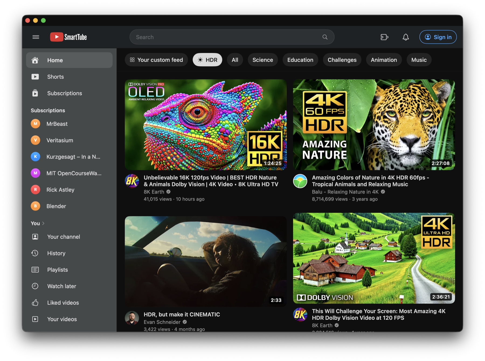
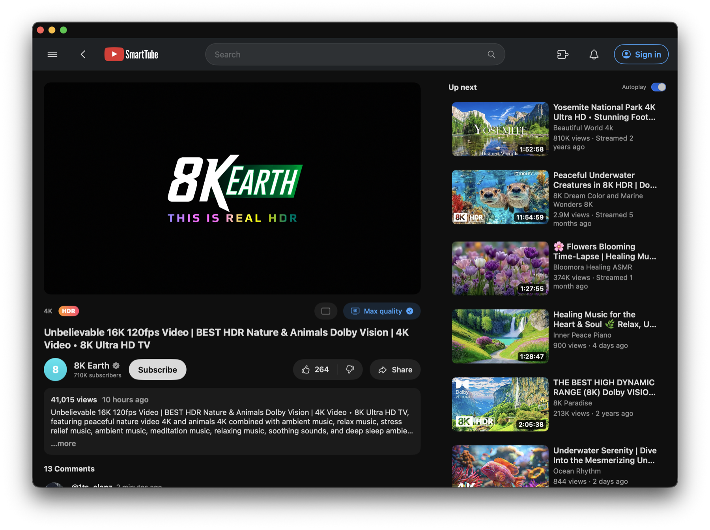

<p align="center">
  
</p>

<h1 align="center">SmartTube for Mac</h1>

A native macOS YouTube front end. It plays the **real** `youtube.com` watch page in a
cropped WebView (so playback, HDR, DRM, and captions are exactly YouTube's own), while every
other surface — recommendations, subscriptions, search, channels, Shorts, playlists, watch
history — is rendered as a native SwiftUI app personalized to **your** account. There is no
Google Cloud project and no OAuth: it reuses the YouTube login you already have in Firefox.

<p align="center">
  
</p>

> **Not affiliated with YouTube or Google** — nor with the [SmartTube](https://github.com/yuliskov/SmartTube) Android-TV client (unrelated project, similar name). A personal project. See [Legal](#legal).

## Download

### **[Download the latest SmartTube.dmg](https://github.com/adamkbritsch/SmartTube-for-Mac/releases/latest)**

Open the `.dmg`, drag **SmartTube** onto **Applications**, then launch it.

> **First launch only:** the app isn't notarized (that needs a paid Apple Developer account), so macOS Gatekeeper blocks it the first time. **Right-click SmartTube and choose Open**, then click **Open** in the dialog — you only need to do this once, and it's trusted from then on. (Equivalent: `xattr -dr com.apple.quarantine /Applications/SmartTube.app`.)

Needs an **Apple Silicon M3 or newer** Mac and **Firefox** signed into YouTube — see [Requirements](#requirements). Prefer to build from source? Jump to [Build & run](#build--run).

## Features

- **Real playback, native everything else.** The watch view is the genuine YouTube player
  (cropped to just the video); the rest of the app is native SwiftUI talking to a small local
  backend that reads your session and calls YouTube's internal InnerTube API.
- **Your account.** Personalized home feed, your real subscriptions, search, channel pages,
  Shorts, playlists, and watch history — plus write actions that hit your real account:
  **Subscribe**, **Like**, and **mark-as-watched** (watching a video logs it to your real
  YouTube history, so recommendations and the red "watched" bar stay in sync).
- **HDR** on Apple Silicon **M3+** (see [Requirements](#requirements)) — genuine 2160p60 HDR
  via the system EDR pipeline.
- **Ad blocking** via the real **uBlock Origin** extension (`WKWebExtension`, macOS 15.4+),
  backed by an inline ad-payload prune so ads never load; plus **SponsorBlock** auto-skip.
- **Extras:** a GPU "Enhance" detail-sharpen, a GPU-saver mode that automatically sheds load
  when another GPU-heavy app is running, a max-resolution pin, theater mode, and an HDR
  discovery shelf.

## Screenshots

<p align="center">
  <br>
  <em>The HDR shelf — genuine 4K/HDR content, decoded through the system EDR pipeline.</em>
</p>

<p align="center">
  <br>
  <em>The watch page — the real YouTube player cropped to just the video, with a native up-next rail.</em>
</p>

## Requirements

- **Apple Silicon M3 or newer — required.** Apple removed VP9 decoding from WebKit, so
  YouTube's HDR/4K streams now arrive only as AV1, which only M3-and-newer chips can decode.
  SmartTube for Mac checks for an AV1 hardware decoder at launch and, on older Macs, tells you why and
  exits (rather than degrade to 1080p SDR). This is a one-line gate in `main.swift` if you want
  to relax it to "warn but run".
- **macOS 15.4+** recommended (needed to load real uBlock Origin via `WKWebExtension`);
  macOS 14 is the minimum to launch.
- **Firefox**, logged into YouTube (that's where the session comes from).

That's it to *run* the [downloadable app](#download). Building from source additionally needs a recent **Swift toolchain** (5.9+ — the Command Line Tools are enough, full Xcode is not required).

## Build & run

Prefer the [prebuilt DMG](#download) unless you want to build it yourself. From source:

```
git clone <this repo>
cd SmartTube-for-Mac
./package.sh
```

`package.sh` builds both Swift packages, downloads uBlock Origin + SponsorBlock from their
official releases (first build only; see [THIRD-PARTY.md](THIRD-PARTY.md)), assembles
`SmartTube.app`, and installs it to `/Applications`. Launch it from there. The app **auto-spawns
its own backend** on `127.0.0.1:8080` — there's no separate server to start.

For development you can run the pieces directly:
```
swift build -c release --package-path backend   # the app looks for this binary
swift run --package-path macos
```

## Sign in

Click **Sign in** — that's it. SmartTube for Mac reads the YouTube login already in your Firefox profile
(the same idea as `yt-dlp --cookies-from-browser`): the backend reads Firefox's local
`cookies.sqlite`, builds a `SAPISIDHASH` auth header from your session, and calls InnerTube as
you. Cookies are read-only and never stored or sent anywhere except authenticated calls to
`youtube.com`. Sign-in state is in memory, so click **Sign in** again after a backend restart.

Only Firefox is wired up; be logged into YouTube there first.

## Also in this repo

The backend also serves a small Firefox-viewable web clone, and there's a companion Firefox
extension (`extension/`) that toggles shared settings — both secondary to the macOS app.

## Layout

```
macos/       SwiftUI app (SwiftPM executable; AppKit bootstrap + WebKit player)
backend/     Vapor package — InnerTube client, Firefox-session auth, feed/search/watch APIs
extension/   Companion Firefox WebExtension (optional)
patches/     SmartTube for Mac's patch to uBlock Origin (mt-shim.js)
package.sh   Build + assemble SmartTube.app + install
```

## Gatekeeper

The app is **ad-hoc signed**, not notarized. Building locally with `./package.sh` and running
from `/Applications` works without prompts. If you ever move a built `SmartTube.app` between Macs,
macOS will quarantine it — right-click and choose **Open**, or run
`xattr -dr com.apple.quarantine /Applications/SmartTube.app`.

## Legal

SmartTube for Mac is a personal, educational project. It is **not affiliated with, authorized by, or
endorsed by YouTube or Google.**

- It uses YouTube's private InnerTube API and your local Firefox cookies to act as you.
  Nothing leaves your machine except the calls YouTube would make for you anyway.
- It blocks ads (uBlock Origin) and skips sponsor segments (SponsorBlock). This may conflict
  with YouTube's Terms of Service. **Use at your own risk.**
- It does **not** download video files; playback is always YouTube's own player.
- Provided "as is" under the MIT license, with no warranty. You are responsible for your use.

If you are a rights holder with a concern, open an issue.
